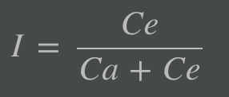

:sectnums:
:toc:

= Architecture Coupling

== Introduction

* Coupling :
** Two software modules or subsystems are coupled (tightly or loosely) if changes in module 1 impacts module 2 or vice versa
** Coupling arises (or is reduced) by bounded context based domain driven design
** Coupling is one of the aspects defined and resolved using https://en.wikipedia.org/wiki/Architecture_tradeoff_analysis_method[Architecture Tradeoff Analysis Method] (ATAM)]

[NOTE]
====
* https://www.martinfowler.com/bliki/BoundedContext.html[Frowler definition of Bounded Context]
* https://martinfowler.com/bliki/DomainDrivenDesign.html[Frowler link to DDD]
====

* Trade-off analysis in architecture design choice using coupling
** Find coupling
** Analyze dependency and reason for coupling
** Determine impact of change

* Architectural Quantum
** Independent deployable artifact
** High functional cohesion
** High static coupling
*** Measure of static dependencies like OS, frameworks , libraries
** Synchronous dynamic coupling
*** Communications at run time - synchronous, asynchronous with other modules, software or engines
*** Generally also deducted using architectural fitness function

[NOTE]
====
* Need to study about architectural fitness function
** How are they implemented and measured?

====

== Quantum of coupling

=== Measurement

// stem:[I = (Ce) / (Ca + Ce)]

[NOTE]
====
* I = Software instability
* Ca = Afferent couplings
* Ce = Efferent couplings
** Outgoing dependencies

* I ~ 0 : Stable system
* I ~ 1 : Unstable system
====

[plantuml]
----
@startuml
    : hello here;
    : hello there;
@enduml
----

